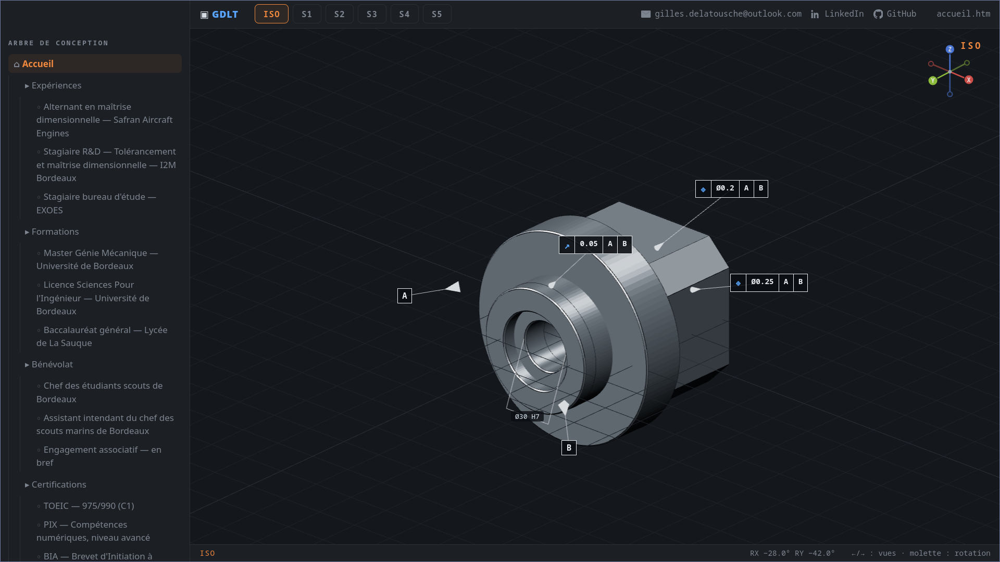
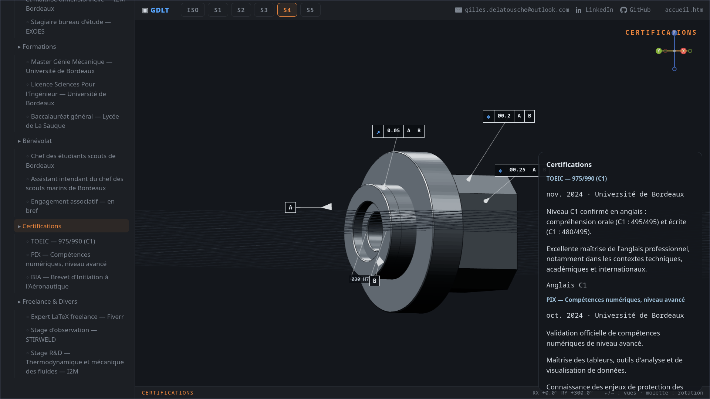

# Portfolio — Gilles, Ingénieur Génie Mécanique

Portfolio web à l'interface inspirée de **logiciel de CAO** :
arbre de spécifications dépliable à gauche, fiche détaillée au clic,
visionneuse 3D animée.

Cette interface reprends une pièce que j'ai usiné en 2026. 
Les spécifications ISO de la pièce non aucun sens pour l'instant.




## Lancer en local

```bash
python -m http.server 8000
# puis ouvrir http://localhost:8000
```

